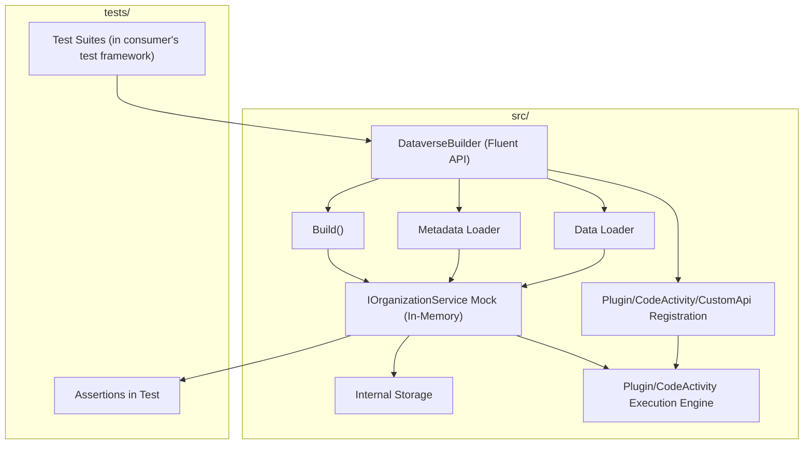

# Component Architecture

## Builder-Based Architecture for Test Setup

This framework provides a fluent builder API (`DataverseBuilder`) to configure and set up the Dataverse environment for tests. The builder supports:
- Loading entity metadata from files or programmatically
- Loading data from files or programmatically
- Registering plugins, code activities, and custom APIs with detailed configuration
- Producing a mock/in-memory implementation of `IOrganizationService` for use in tests

### Main Components
- **DataverseBuilder (Fluent API):** Central entry point for configuring metadata, data, plugins, code activities, and custom APIs. Supports method chaining for a fluent experience.
- **Metadata Loader:** Loads entity metadata from files (JSON, XML, YAML) or via code.
- **Data Loader:** Loads test data from files or via code.
- **Plugin/CodeActivity/CustomApi Registration:** Fluent configuration for steps, messages, parameters, and other details.
- **Build():** Finalizes the configuration and produces an in-memory mock of `IOrganizationService`.
- **IOrganizationService Mock (In-Memory):** Simulates Dataverse operations (`Create`, `Update`, etc.), maintains internal storage, and triggers registered plugins/code activities as appropriate.
- **Internal Storage:** Exposes entity data for assertions in tests.
- **Plugin/CodeActivity Execution Engine:** Handles execution of registered plugins, code activities, and custom APIs during mock service operations.

> **Note:** This framework is agnostic to the test runner. Consumers use their preferred testing framework (e.g., xUnit, NUnit, MSTest) and leverage the builder and mock service for Dataverse-specific setup and assertions.

## Architecture Diagram

